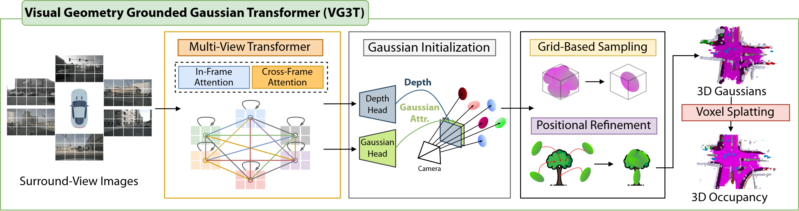

# VG3T: Visual Geometry Grounded Gaussian Transformer
### [Paper](https://www.arxiv.org/abs/2512.05988)  | [Project Page](https://junho2000.github.io/vg3t.github.io/)  | [Code](https://github.com/junho2000/VG3T) 

> VG3T: Visual Geometry Grounded Gaussian Transformer

> [Junho Kim](https://junho2000.github.io/) , [Seongwon Lee](https://sungonce.github.io/)$\dagger$

$\dagger$ Corresponding Author.

## News

- **[2026/1/31]** VG3T is accepted to ICRA2026!
- **[2025/12/28]** Paper released on [arXiv](https://www.arxiv.org/abs/2512.05988).

## Demo


## Overview




## Getting Started

Code will be released upon publication. 

## Related Projects

Our code is based on the excellent work [GaussianFormer](https://github.com/huang-yh/GaussianFormer).

## Citation

If you find this project helpful, please consider citing the following paper:
```
@article{kim2025vg3tvisualgeometrygrounded,
  author    = {Junho Kim and Seongwon Lee},
  title     = {VG3T: Visual Geometry Grounded Gaussian Transformer},
  journal   = {IEEE International Conference on Robotics and Automation (ICRA)},
  year      = {2026},
}
```
